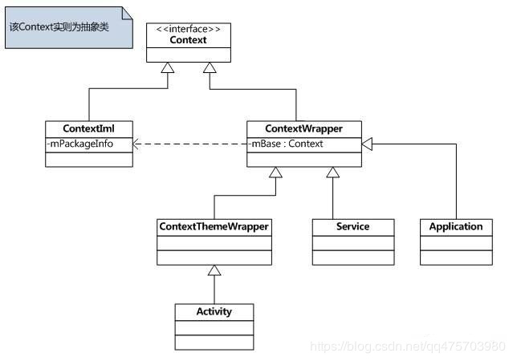
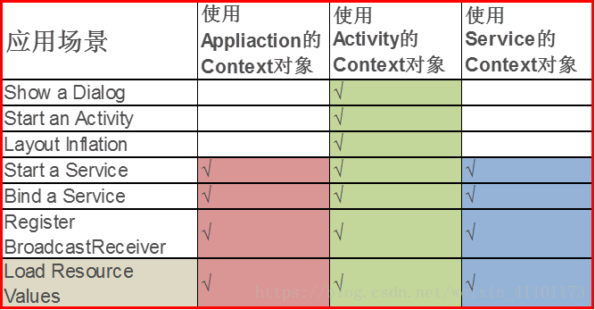

# Application和Actvity的Context的区别

+ （1）类的继承关系不一样

. 

+ （2）生命周期不一样

 在需要传递Context参数的时候，如果是在Activity中，我们可以传递this（这里的this指的是Activity.this，是当前Activity的上下文）或者Activity.this。这个时候如果我们传入getApplicationContext()，我们会发现这样也是可以用的。可是大家有没有想过传入Activity.this和传入getApplicationContext()的区别呢？首先Activity.this和getApplicationContext()返回的不是同一个对象，一个是当前Activity的实例，一个是项目的Application的实例，这两者的生命周期是不同的，它们各自的使用场景不同，this.getApplicationContext()取的是这个应用程序的Context，它的生命周期伴随应用程序的存在而存在；而Activity.this取的是当前Activity的Context，它的生命周期则只能存活于当前Activity，这两者的生命周期是不同的。getApplicationContext() 生命周期是整个应用，当应用程序摧毁的时候，它才会摧毁；Activity.this

+ （3）作用场景不一样

. 